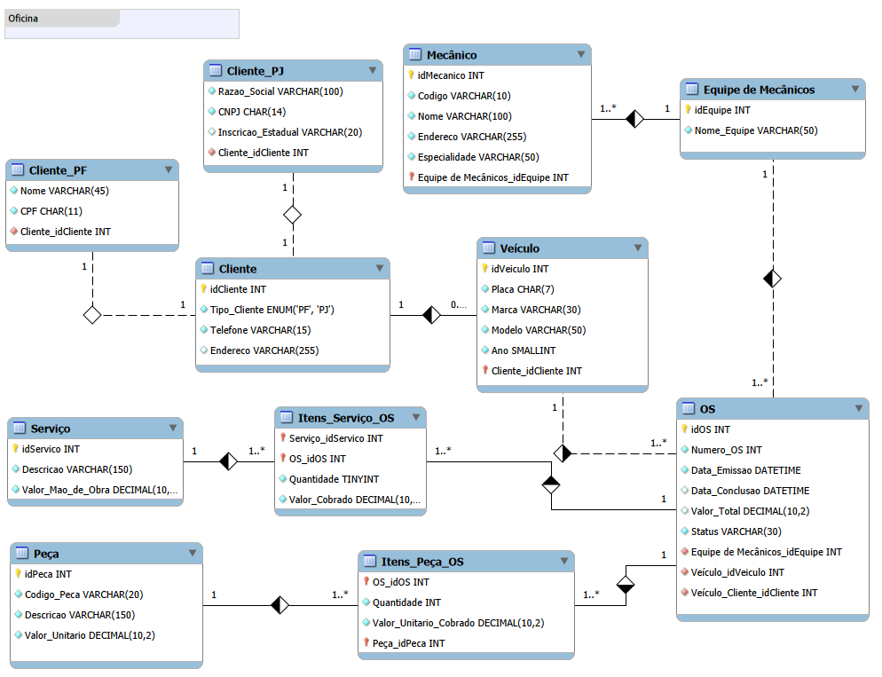

# 🛠️ Sistema de Gerenciamento de Ordens de Serviço (Oficina Mecânica)
> Desafio de Projeto: Construindo um Esquema Conceitual do Zero — Bootcamp Análise de Dados DIO

Este repositório contém o modelo de banco de dados desenvolvido para o controle e gerenciamento de execução de ordens de serviço (OS) em uma oficina mecânica, atendendo aos requisitos propostos no desafio da DIO.

---

## 📖 Contexto e Narrativa do Desafio
O sistema visa cobrir o fluxo completo de uma oficina:
1. Clientes cadastram seus veículos para consertos ou revisões periódicas.
2. Cada veículo é designado a uma equipe de mecânicos responsável por avaliar os problemas e preencher a Ordem de Serviço (OS).
3. O valor total da OS é calculado dinamicamente com base em uma tabela de referência de mão de obra (serviços) e no valor das peças utilizadas.
4. Os serviços só são executados após a autorização explícita do cliente.
5. A mesma equipe que avalia é a responsável por executar as tarefas.

---

## 📐 Padrão de Notação e Visualização do Modelo
Para a construção do diagrama no *MySQL Workbench*, optei pela utilização da estética **Classic**. Essa escolha visa destacar visualmente a semântica e o ciclo de vida das relações entre as entidades:
* **Losangos Brancos (Agregação/Herança):** Utilizados para representar a especialização da entidade `Cliente` para os tipos específicos `Cliente_PF` (Pessoa Física) e `Cliente_PJ` (Pessoa Jurídica).
* **Losangos Pretos (Composição/Forte Dependência):** Aplicados para evidenciar entidades que possuem forte dependência de existência ou ciclo de vida com a tabela principal, como o vínculo direto da `OS` com o `Veículo` e as tabelas associativas de itens (`Itens_Peça_OS` e `Itens_Serviço_OS`).

### 🖼️ Visualização do Diagrama

---

## 🧭 Premissas Assumidas e Decisões de Negócio
Conforme solicitado na descrição do desafio, foram adotadas soluções baseadas em boas práticas para cobrir pontos não detalhados na narrativa:

1. **Diferenciação de Clientes (PF/PJ):** Foi aplicada a estratégia de Especialização/Herança. Uma tabela mãe (`Cliente`) guarda os dados de contato genéricos, enquanto sub-tabelas armazenam atributos estritamente específicos (`CPF` e `Nome` para Física; `CNPJ`, `Razão Social` e `Inscrição Estadual` para Jurídica).
2. **Relacionamento N:M (Muitos para Muitos):** Como uma Ordem de Serviço pode conter múltiplos serviços e usar várias peças diferentes, foram criadas as tabelas associativas `Itens_Peça_OS` e `Itens_Serviço_OS`.
3. **Histórico de Preços (Auditoria):** As tabelas de itens gravam o valor cobrado *no momento da execução*. Isso garante que se o preço de uma peça ou da mão de obra for alterado na tabela de referência futuramente, os valores das ordens de serviço antigas (já fechadas) permaneçam intactos.

---

## 🗂️ Dicionário de Dados (Datatypes e Restrições)

### 1. Clientes e Especializações
* **Cliente:** `idCliente` (INT PK AI), `telefone` (VARCHAR), `endereco` (VARCHAR), `tipoCliente` (ENUM).
* **Cliente_PF:** `Cliente_idCliente` (INT PK FK), `nome` (VARCHAR NN), `cpf` (CHAR(11) NN UQ).
* **Cliente_PJ:** `Cliente_idCliente` (INT PK FK), `razaoSocial` (VARCHAR NN), `cnpj` (CHAR(14) NN UQ), `inscricaoEstadual` (VARCHAR).

### 2. Veículo e Mecânicos
* **Veículo:** `idVeiculo` (INT PK AI), `placa` (CHAR(7) NN UQ), `marca` (VARCHAR), `modelo` (VARCHAR), `ano` (SMALLINT), `Cliente_idCliente` (INT FK).
* **Equipe_de_Mecânicos:** `idEquipe` (INT PK AI), `nomeEquipe` (VARCHAR NN UQ).
* **Mecânico:** `idMecanico` (INT PK AI), `codigo` (VARCHAR NN UQ), `nome` (VARCHAR NN), `endereco` (VARCHAR NN), `especialidade` (VARCHAR NN), `Equipe_idEquipe` (INT FK).

### 3. Ordem de Serviço (OS), Peças e Serviços
* **OS:** `idOS` (INT PK AI), `numeroOS` (INT NN UQ ZF), `dataEmissao` (DATETIME NN), `dataConclusao` (DATETIME), `valorTotal` (DECIMAL G), `status` (VARCHAR NN), `Veículo_idVeiculo` (INT FK), `Equipe_idEquipe` (INT FK).
* **Peça:** `idPeca` (INT PK AI), `codigoPeca` (VARCHAR NN UQ), `descricao` (VARCHAR NN), `valorUnitario` (DECIMAL NN).
* **Serviço:** `idServico` (INT PK AI), `descricao` (VARCHAR NN UQ), `valorMaoDeObra` (DECIMAL NN).

### 4. Tabelas Associativas (N:M)
* **Itens_Peça_OS:** `OS_idOS` (INT PK FK), `Peça_idPeca` (INT PK FK), `quantidade` (INT NN), `valorUnitarioCobrado` (DECIMAL NN).
* **Itens_Serviço_OS:** `OS_idOS` (INT PK FK), `Serviço_idServico` (INT PK FK), `quantidade` (INT NN), `valorCobrado` (DECIMAL NN).

---
*Legenda: PK = Primary Key | FK = Foreign Key | NN = Not Null | UQ = Unique | ZF = Zero Fill | AI = Auto Increment | G = Generated Column (Calculada)*
